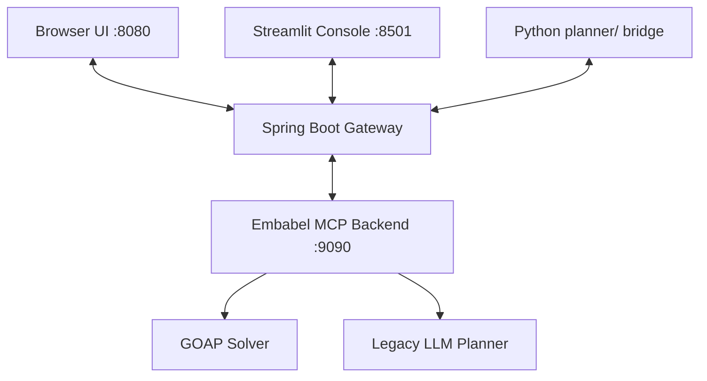

# LLM-GOAP

LLM-GOAP is a hybrid GOAP and LLM planning workspace that combines a Spring Boot gateway, an Embabel-based planning backend, a static browser UI, and a Streamlit developer console. The repository now reflects the current multi-surface setup rather than a single monolithic frontend.

## What is implemented

The platform currently provides:

- A Spring Boot gateway that exposes the planning API at `/api/plans`.
- An Embabel backend on port `9090` that resolves plans and falls back to the legacy planner when needed.
- A browser frontend served from `src/main/resources/static/` with goal entry, Mermaid rendering, plan metadata, and tabbed visualizations.
- A Streamlit console in `streamlit-ui/` for debugging plans, traces, and reports.
- Python bridge code in `planner/` for AI integration and Mermaid generation.

## Frontend status

The main user-facing frontend is not a separate app in the `frontend/` folder. It lives in the Spring Boot static assets:

- [src/main/resources/static/index.html](src/main/resources/static/index.html)
- [src/main/resources/static/app.js](src/main/resources/static/app.js)
- [src/main/resources/static/style.css](src/main/resources/static/style.css)

That UI is functional and styled, with theme toggling, plan submission, Mermaid diagrams, action steps, metrics, and a visualization dashboard. The `frontend/` directory is currently just a placeholder.

The second UI is the Streamlit developer console in [streamlit-ui/app.py](streamlit-ui/app.py). It is oriented toward inspection and debugging rather than end-user planning.

## Current architecture



In practice, the backend defaults to the Embabel runtime, and plan generation falls back when the runtime throws or when external services are unavailable.

## Requirements

- Java 21 JDK
- Maven Wrapper or Maven 3.8+
- Python 3.10+
- Optional: Ollama for local LLM inference

If you use external planning/search integrations, set the relevant environment variables before starting the services.

## Local setup

1. Start the Embabel backend.

```powershell
cd embabel-mcp
.\mvnw.cmd spring-boot:run
```

2. Start the main gateway from the repository root.

```powershell
.\mvnw.cmd spring-boot:run
```

3. Start the Streamlit console if you want the debugging UI.

```powershell
cd streamlit-ui
python -m venv venv
.\venv\Scripts\activate
pip install -r requirements.txt
streamlit run app.py
```

## Current limitations

- The legacy planner still uses mostly linear action chains when it falls back.
- The system is aimed at local developer use, not production-hardening.
- Authentication and rate limiting are not implemented.
- Some timeline and parsing behavior is still template-driven rather than fully structured.

## Project structure

```text
.
├── src/main/java/                 Spring Boot gateway and app logic
├── src/main/resources/static/     Main browser frontend
├── embabel-mcp/                   Embabel planning backend
├── planner/                       Python bridge utilities
├── streamlit-ui/                  Streamlit debugging console
└── docs/                          Setup, architecture, and status notes
```

## Notes

- The most accurate project-wide status is documented in [docs/PROJECT_STATUS.md](docs/PROJECT_STATUS.md).
- The setup flow is documented in [docs/SETUP.md](docs/SETUP.md).
- The root README is now aligned with the current repository layout and frontends.
