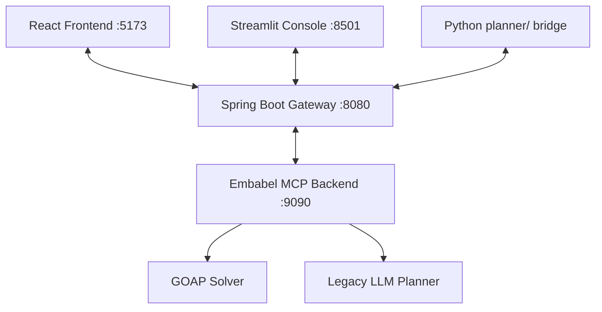

# LLM-GOAP

LLM-GOAP is a hybrid GOAP and LLM planning workspace that combines a Spring Boot gateway, an Embabel-based planning backend, a premium React user-facing web app, and a Streamlit developer console.

## Architecture & Components



The workspace consists of the following components:

- **React Frontend (`frontend/`)**: A premium user interface styled with Material UI (MUI 6), custom glassmorphism components, and a WebGL-based Perlin noise background (`SoftAurora`).
- **Spring Boot Gateway (`src/`)**: A gateway that coordinates API routes and exposes planning endpoints at `/api/plans`.
- **Embabel MCP Backend (`embabel-mcp/`)**: The main intelligence layer running on port `9090` that coordinates agent execution and falls back when external resources are offline.
- **Streamlit Console (`streamlit-ui/`)**: A developer inspect console for troubleshooting, traces, and metrics reports.
- **Python Solver Bridge (`planner/`)**: Python scripts that facilitate AI search and structure plan execution matrices.

---

## Local Setup

### 1. Embabel Planning Backend
Start the planning runtime first:
```powershell
cd embabel-mcp
.\mvnw.cmd spring-boot:run
```

### 2. Spring Boot Gateway
Start the API gateway from the repository root:
```powershell
.\mvnw.cmd spring-boot:run
```

### 3. Premium React Web App
Run the Vite development server to launch the planning UI:
```powershell
cd frontend
npm install
npm run dev
```
The interface will be available at [http://localhost:5173](http://localhost:5173).

### 4. Streamlit Debug Console (Optional)
If you wish to view execution traces and metrics reports:
```powershell
cd streamlit-ui
python -m venv venv
.\venv\Scripts\activate
pip install -r requirements.txt
streamlit run app.py
```

---

## Workspace Structure

```text
.
├── frontend/                      Premium React + Vite user-facing planning app
├── src/main/java/                 Spring Boot gateway and app logic
├── embabel-mcp/                   Embabel planning backend
├── planner/                       Python bridge utilities
├── streamlit-ui/                  Streamlit debugging console
└── docs/                          Setup, architecture, and status notes
```

---

## Verification & Validation

To verify the type safety and lint integrity of the React frontend, run the following inside the `frontend/` directory:
- **Typecheck**: `npm run typecheck`
- **Linter**: `npm run lint`
- **Format check**: `npm run format:check`

